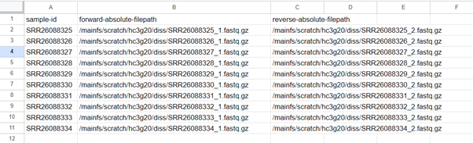
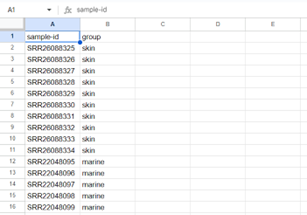

**Step 1: Create your manifest and metadata files**

Open the metadata file of the study you want to use. Also, open up a blank spreadsheet on google sheets. You will need to make two files – one is a manifest file (used to import your sequences into qiime) and one is a metadata file (used to know which sample is in which group). 

First, we will make the manifest file. For this you will need to create a file where you list all the run codes that you will use under the heading – ‘sample-id’ as well as their forward and reverse file paths (under the heading forward-absolute-filepath and reverse-absolute-filepath).  put our files into /mainfs/scratch/username/diss. Also, the file names for the forward reads for each file will be in this format: ERR599353_1_unpaired.fastq.gz and the reverse reads will be in this format: ERR599353_2_unpaired.fastq.gz.

You will then need to export this file as a **.tsv** file.

Then you will need to create your metadata file. This will be where you have a list of your sample-ids and the group they belong to. Again, you will do this in google sheets and export as a **.tsv** file. The file should have two columns: 'sample-id' and 'group'.

